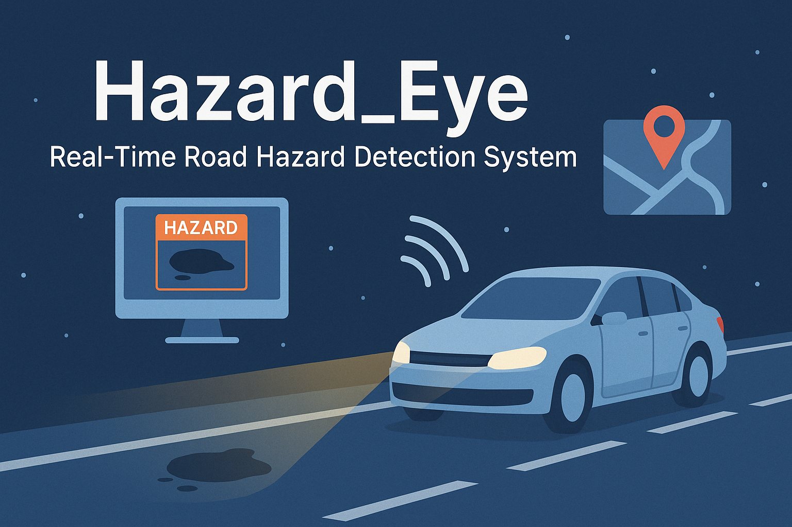

# 🚧 Hazard_Eye – Real-Time Road Hazard Detection System

Hazard_Eye is a smart road safety system that detects real-time hazards such as potholes, speed bumps, and animals using computer vision. It integrates AI with modern web technologies to alert users and auto-report danger zones to local authorities. Designed for smart cities and intelligent transport systems, this project leverages FastAPI, React.js, and YOLOv12.

---



---

## 🧠 Overview

- **Live Hazard Detection** using YOLOv12
- **Real-time Alerts** through UI and automated notifications
- **Smart Braking Simulation** logic based on object proximity
- **Map Integration** using TomTom API to visualize hazard zones
- **Automated Reporting** with email alerts and geo-tagged locations

---

## 🔧 Tech Stack

| Layer      | Technology                         |
|------------|------------------------------------|
| Frontend   | React.js, HTML, CSS, JavaScript    |
| Backend    | FastAPI (Python)                   |
| AI Model   | YOLOv12 (PyTorch)                  |
| Mapping    | TomTom Maps API                    |
| Deployment | Uvicorn, GitHub, Localhost         |
| Extras     | SMTP Email, Geolocation, JSON APIs |

---

## 📁 Project Structure

```bash
Hazard_Eye/
├── backend/
│   ├── main.py              # FastAPI server logic
│   ├── detect.py            # Object detection integration
│   ├── utils/               # Helper methods
│   └── config.py            # API keys, credentials
├── frontend/
│   ├── src/
│   │   ├── components/      # UI components
│   │   ├── pages/           # Views
│   │   └── App.js           # Main app logic
├── media/                   # Screenshots / video samples
├── assets/                  # Images, banner, icons
├── README.md
└── requirements.txt
```

---

## 🚀 Getting Started

### 🛠 Prerequisites

- Python 3.8+
- Node.js 18+
- npm or yarn
- Git

---

### 📌 Installation Steps

#### 1️⃣ Clone the Repository

```bash
git clone https://github.com/atharva-47/Hazard_Eye-Road-Hazard-Detection.git
cd Hazard_Eye-Road-Hazard-Detection
```

#### 2️⃣ Setup Backend (FastAPI)

```bash
cd backend/
pip install -r requirements.txt
uvicorn main:app --reload
```

#### 3️⃣ Setup Frontend (React)

```bash
cd frontend/
npm install
npm start
```

Once both servers are running, access the application at:  
👉 **http://localhost:51730**

---

## 📊 Evaluation & Methodology

This section documents how the model was trained, evaluated, and where it falls short — because benchmark numbers without context are meaningless.

### Dataset Construction

Training data was assembled by **merging multiple pothole and speed bump datasets sourced from Roboflow**, totalling approximately **~33,000 images** across varied road conditions, geographies, and lighting scenarios.

Key decisions made during dataset construction:

- **Multi-source merging** was chosen over a single dataset to increase class and environmental diversity
- Datasets were reviewed for label consistency — bounding box annotation style varies across Roboflow contributors, which introduces known label noise
- Underrepresented classes (speed bumps vs. potholes) were noted but not rebalanced — this is a documented limitation

> ⚠️ **Known dataset bias:** The majority of source images originate from US and European road datasets. Indian road conditions (unpaved surfaces, irregular pothole shapes, monsoon damage patterns) are underrepresented.

### Train / Validation / Test Split

Standard **80 / 10 / 10 split** applied. The test set was held out before any training or hyperparameter tuning to prevent data leakage.

### Model

YOLOv12 pretrained weights fine-tuned on the merged dataset using standard transfer learning. No custom architecture modifications — the goal was to evaluate whether off-the-shelf YOLO fine-tuning generalises to this specific problem domain.

### Results

| Metric | Value |
|---|---|
| mAP@0.5 (held-out test set) | ~95% |
| Hazard response simulation improvement | ~70% vs. baseline (no detection) |
| Manual reporting effort reduction | ~80% (automated vs. manual zone logging) |
| Hazard zones mapped | 10+ |

> ⚠️ **Important caveat:** These figures reflect performance on a held-out test set drawn from the **same distribution as the training data**. Real-world deployment accuracy will be lower — see Known Limitations below.

### What the Model Gets Wrong

Documenting failure modes is as important as reporting accuracy:

- **Low-light and nighttime conditions** — detection confidence drops significantly; training data skews heavily towards daytime imagery
- **Motion blur** — fast camera movement (vehicles at speed) degrades bounding box precision
- **Partially occluded hazards** — potholes covered by water, debris, or shadow are frequently missed or misclassified
- **Class imbalance effects** — recall on speed bumps is lower than on potholes due to fewer training samples for that class
- **Annotation inconsistency** — merging datasets with different labelling conventions introduces noise that is difficult to fully quantify
- **Geographic distribution shift** — model has not been evaluated on Indian road conditions specifically, despite being built for that use case

### What This Does Not Measure

- Real-world false positive rate under continuous video feed
- Inference latency on edge/constrained hardware (tested on localhost only)
- Generalisation to weather conditions not represented in the dataset (fog, heavy rain)
- Performance degradation over time without retraining

---

## 📬 Email Alert System

- Configure sender credentials in `backend/config.py`
- Automatically sends an email when a hazard is detected
- Includes hazard type, timestamp, and geo-coordinates
- Can be extended to government alert/reporting systems

---

## 🌍 Map Visualization

- Uses **TomTom Maps API**
- Plots hazard zones dynamically based on detection
- Realtime and interactive map view on frontend
- Can highlight high-risk areas over time

---

## 🎥 Demo

> [](https://youtu.be/OD7fzQ6UxjY)

---

## 🔭 Future Research Directions

These are genuine open problems, not just feature requests:

- **Domain adaptation for Indian roads** — fine-tuning on locally collected data to close the geographic distribution gap
- **Nighttime detection** — exploring low-light augmentation and infrared input strategies
- **Continuous learning pipeline** — model retraining as new hazard reports are confirmed by users (human-in-the-loop feedback)
- **Uncertainty quantification** — flagging low-confidence detections rather than treating all outputs equally
- **Cross-dataset evaluation** — benchmarking against a fully independent dataset not sourced from Roboflow to measure true generalisation

---

## 👤 Author

**Atharv Bargir**  
🔗 [Portfolio](https://atharvabargir.me/portfolio)  
🔗 [LinkedIn](https://linkedin.com/in/atharv-bargir-081927250)  
📧 [atharvabargir3112@gmail.com](mailto:atharvabargir3112@gmail.com)

---

## 📝 License

This project is licensed under the **MIT License**.  
Feel free to use, modify, and distribute with proper credit.

---

## 🙌 Contributions

Contributions are welcome!  
Feel free to open an issue or submit a pull request.
